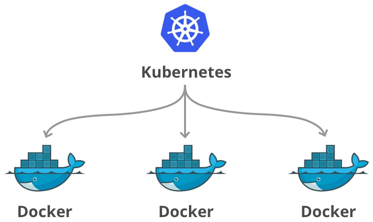
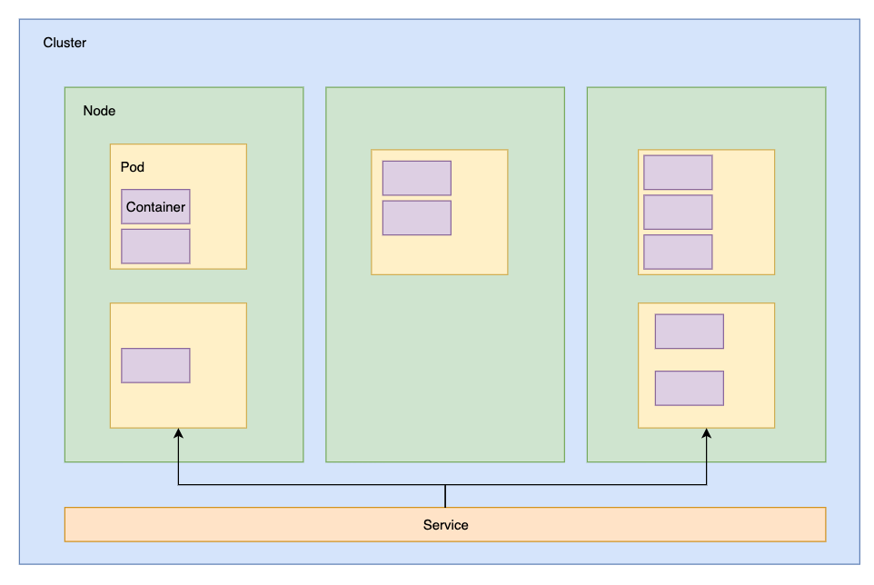
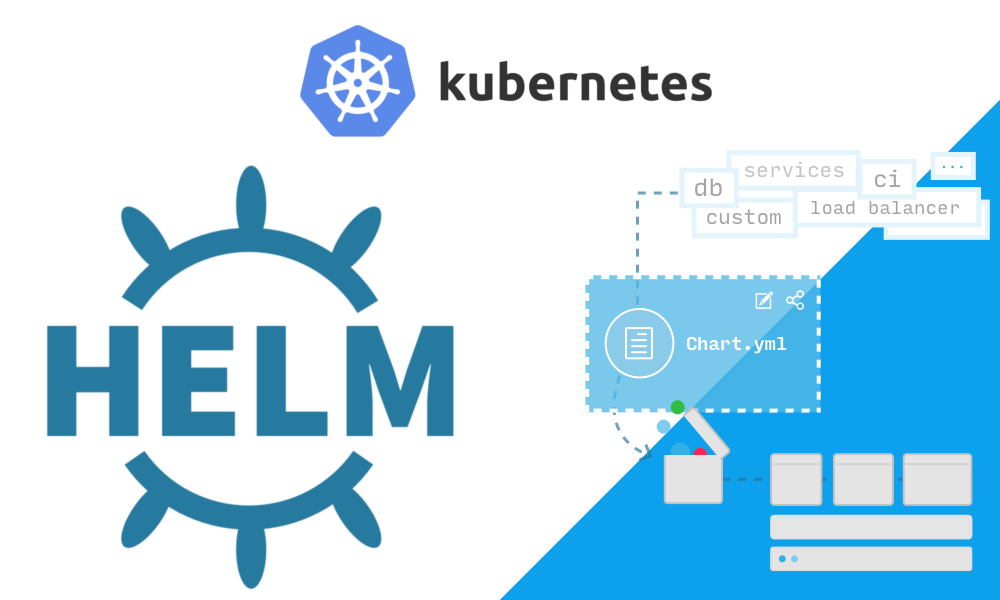

# Kubernetes and Helm

## Kubernetes + helm local setup

For mac:
- Install Docker for Desktop if you have not already: https://www.docker.com/products/docker-desktop
- Set up kubernetes locally:
In docker for desktop, go to Preferences > Kubernetes > Enable Kubernetes.
Once you see the green dot and "Kubernetes is running", you can switch contexts to docker-desktop
- Install kubectl 
```bash
brew install kubernetes-cli
```
- Switch and confirm you are in your local k8s cluster
```bash
kubectl config use-context docker-desktop
kubectl config current-context
docker-desktop
```
- Install helm
```bash
brew install kubernetes-helm
```
- Initialize helm for this context
```bash
helm init
```

## Prerequisites
- Assumes general knowledge of Docker containers.
- Install redis-cli (brew install redis)

# Kubernetes




## Terminology



- **kubernetes**: Greek for "helmsman"/"captain" - container orchestration for automating deployments, scaling, and management.
- **node**: worker machine that contains services necessary to run pods managed by master components
- **cluster**: A group of kubernetes nodes
- **container**: a light weight version of a virtual machine with an isolated piece of filesystem, cpu, memory, etc...
- **pod**: group of containerized components. Guaranteed to be co-located on a node and can share resources.
- **replica set**: grouping mechanism that maintains declared number of instances of a pod
- **deployment**: higher level mechanism that manages what happens to a replica set (updates, roll backs, etc).
- **stateful set**: like a deployment, only the state of the pods are preserved if they are restarted or destroyed.
- **service**: groups pods by labels and load balances traffic to them in round-robin manner.
- **ingress**: expose http(s) routes from outside the cluster to services within the cluster.
- **volume**: external/persistent storage that can be mountd onto a pod and shared between pods.
- **namespace**: used for partitioning and organization of resources (e.g. 'prod' and 'dev' namespaces can live in the same k8s cluster)
- **config map**: configuration, like environment variables, that can be attached to a pod or set of pods.
- **secret**: like config maps, but base64 encoded.
- **manifest files**: kubernetes files (yaml or json) that define your resources


## Deploy manifest files

Set up a python flask webserver with a redis backend that keeps track of page views.

1. Create a deployment for redis
```
$ kubectl apply -f k8s/redis-deployment.yaml
deployment.apps/redis created

$ kubectl get deployment
NAME    READY   UP-TO-DATE   AVAILABLE   AGE
redis   1/1     1            1           23s

$ kubectl get pods
NAME                    READY   STATUS    RESTARTS   AGE
redis-d8f776cc6-29bvn   1/1     Running   0          7s
```

You will see that the deployment has created 1 out of 1 replicas of the redis pods.

2. Create a service for redis

```
$ redis-cli ping
Could not connect to Redis at 127.0.0.1:6379: Connection refused

$ kubectl apply -f k8s/redis-svc.yaml 
service/redis created

$ kubectl get svc
NAME         TYPE        CLUSTER-IP     EXTERNAL-IP   PORT(S)    AGE
redis        ClusterIP   10.98.49.143   <none>        6379/TCP   3s

$ kubectl port-forward service/redis 6379:6379

$ redis-cli ping
PONG
```

3. Deploy web app:

Note that the svc and deployment can go in the same yaml file!

```
$ kubectl apply -f k8s/web.yaml 
service/web created
deployment.apps/web created

$ kubectl get svc
NAME         TYPE        CLUSTER-IP      EXTERNAL-IP   PORT(S)    AGE
redis        ClusterIP   10.98.49.143    <none>        6379/TCP   25m
web          ClusterIP   10.101.20.137   <none>        5000/TCP   18m

$ kubectl get pods 
NAME                    READY   STATUS    RESTARTS   AGE
redis-d8f776cc6-29bvn   1/1     Running   0          11m
web-69cdcbddb-b4577     1/1     Running   0          93s
web-69cdcbddb-s7t8f     1/1     Running   0          93s
web-69cdcbddb-tt8tg     1/1     Running   0          93s
```

4. Port forward and see the magic happen at localhost:5000
```
$ kubectl port-forward service/web 5000:5000
```

5. Delete redis pod and see what happens
```
$ kubectl delete pod redis-d8f776cc6-29bvn
pod "redis-d8f776cc6-29bvn" deleted
$ kubectl get pods 
NAME                    READY   STATUS    RESTARTS   AGE
redis-d8f776cc6-879lr   1/1     Running   0          10s
```

the old pod is gone, but the deployment noticed and spun up a new one.

refresh localhost:5000 - the page counts have started back over :( should have set up a persistent volume... maybe next time

# Helm



## Terminology

- **helm**: (apparatus for steering a ship) - the package manager for kubernetes to configure/deploy.
- **chart**: package which consists of templated yaml files that can be rendered into k8s manifest files.
- **values**: parameters that can be used in the chart templates.
- **release**: specific configuration and deployment of a chart
- **tiller**: in-cluster component of helm that interacts with the k8s api to manage the k8s resources.

## Creating a helm chart

Create a template to work from

```
$ helm create mychart
mychart/
├── Chart.yaml
├── charts
├── templates
│   ├── NOTES.txt
│   ├── _helpers.tpl
│   ├── deployment.yaml
│   ├── ingress.yaml
│   └── service.yaml
└── values.yaml
```

```
$ head mychart/templates/deployment.yaml 
apiVersion: apps/v1beta2
kind: Deployment
metadata:
  name: {{ include "mychart.fullname" . }}
  labels:
    app.kubernetes.io/name: {{ include "mychart.name" . }}
    helm.sh/chart: {{ include "mychart.chart" . }}
    app.kubernetes.io/instance: {{ .Release.Name }}
    app.kubernetes.io/managed-by: {{ .Release.Service }}
spec:
```

1. Edit to make it look like our k8s objects.

2. Create a namespace to keep things separate:
```
kubectl create namespace mychart
```

3. Deploy the first release of this chart
```
$ helm upgrade mychart mychart --install --namespace mychart --wait
Release "mychart" does not exist. Installing it now.
NAME:   mychart
LAST DEPLOYED: Thu Oct 10 17:58:59 2019
NAMESPACE: mychart
STATUS: DEPLOYED

RESOURCES:
==> v1/Service
NAME   AGE
redis  4s
web    4s

==> v1/Deployment
redis  4s

==> v1beta2/Deployment
web  4s

==> v1/Pod(related)

NAME                    READY  STATUS   RESTARTS  AGE
redis-7bf554988d-h896s  1/1    Running  0         4s
web-56989b5654-fl8sv    1/1    Running  0         4s
```

4. Port forward from this namespace and we can see we are directed to this pod.
```
kubectl port-forward -n mychart service/web 5000:5000

```

5. Change a value
```
helm upgrade mychart mychart --install --namespace mychart --wait --set web.replicaCount=2
...
==> v1/Pod(related)
NAME                   READY  STATUS   RESTARTS  AGE
redis-98d85bc77-45d76  1/1    Running  0         7m
web-c795c955f-j7qwg    1/1    Running  0         4s
web-c795c955f-stvln    1/1    Running  0         7m
```

We've got another web pod.

Notice we are on revision 2
```
$ helm list
NAME                                        REVISION    UPDATED                     STATUS      CHART                   APP VERSION NAMESPACE
mychart                                     2           Thu Oct 10 18:12:10 2019    DEPLOYED    mychart-0.1.0           1.0         mychart  
```
